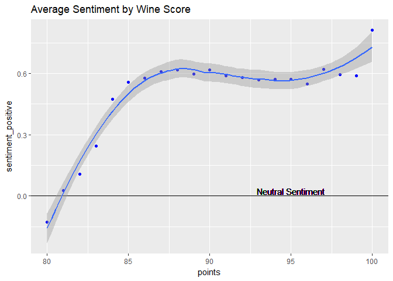

After the grape type and winery, the descriptions are the huge part of the wine purchasing process. Usually these descriptions draw from the ["Wine Aroma Wheel"](https://wcicdn-thewinecellarins.netdna-ssl.com/wp-content/uploads/2010/05/Davis-Wine-Aroma-Wheel1.jpg) developed at UC Davis. It categorizes the scents wines can have, from the pleasant to the less so.

In this analysis I will be using the "tidytext" package developed by David Robinson and Julia Silge to see if I can find insight in how wines are described across varietals. As in my prior analysis of wine, the data used for this analysis can be found in csv generated by [Zack Thoutt]("https://www.kaggle.com/zynicide/wine-reviews/data").


```r
library(knitr)
library(tidyverse)
```

```
## -- Attaching packages -------------------------------------------------------------------- tidyverse 1.2.1 --
```

```
## v ggplot2 2.2.1     v purrr   0.2.4
## v tibble  1.4.2     v dplyr   0.7.5
## v tidyr   0.8.1     v stringr 1.3.1
## v readr   1.1.1     v forcats 0.3.0
```

```
## -- Conflicts ----------------------------------------------------------------------- tidyverse_conflicts() --
## x dplyr::filter() masks stats::filter()
## x dplyr::lag()    masks stats::lag()
```

```r
library(tidytext)
library(tokenizers)
opts_chunk$set(echo = TRUE,message=FALSE,warning=FALSE)
wineData<-read.csv("../winemag-data-130k-v2.csv",header = TRUE,stringsAsFactors = FALSE)
```

#The Breakdown

After reading in the csv, I performed some basic filtering to make sure we didn't have any countries or varietals that were too rare. each country needed a minimum of 500 representatives, and each varietal 300. This left me with 113601 observations.

Next, the unnest_tokens was used to split the descriptions into individual words and any stop words were removed. 


```r
wineData_filtered<-wineData%>%
  group_by(country)%>%
  filter(n()>500)%>%
  ungroup()%>%
  group_by(variety)%>%
  filter(n()>300)%>%
  ungroup()%>%
  select(-X,-taster_twitter_handle)

wineData_TidyDescriptions<-wineData_filtered%>%
  unnest_tokens(word, description)%>%
    anti_join(get_stopwords())
```

The top counted words remaining make sense, as the word "wine", when describing wine, is logical. And since the description is for describing the taste and smell of the wine, much more refined words such as "flavors" and "aromas" are used. Fruit is a common word in describing wine, as it is a desirable quality, so it finds itself as the third most commonly used word in descriptions. 


```r
wineData_TidyDescriptions %>%
  count(word, sort = TRUE) %>%
  head(n=100)%>%
  kable()
```


word                n
-------------  ------
wine            69028
flavors         54914
fruit           43378
aromas          32575
palate          31979
acidity         30243
finish          29529
tannins         27722
drink           27053
cherry          26055
black           25732
ripe            24330
red             18942
spice           16851
notes           16324
oak             16090
dry             15700
rich            15621
berry           14856
fresh           14554
nose            14320
full            14295
now             13788
plum            12955
soft            12176
fruits          12054
well            11936
sweet           11802
blend           11397
texture         11199
blackberry      11168
apple           11166
light           11157
crisp           10950
dark            10945
offers          10420
shows           10345
bodied          10314
cabernet         9851
vanilla          9804
white            9664
citrus           9258
bright           9106
pepper           8965
fruity           8518
raspberry        8500
good             8491
firm             8423
juicy            8409
green            8318
lemon            7833
chocolate        7724
balanced         7417
character        7355
touch            7272
like             7145
years            7100
dried            6882
structure        6882
sauvignon        6881
peach            6724
pear             6575
fine             6522
spicy            6367
wood             6356
pinot            6307
smooth           6211
medium           6030
currant          6022
style            5913
just             5854
made             5802
vineyard         5763
concentrated     5732
herb             5716
tannic           5647
long             5646
tart             5629
herbal           5614
also             5546
merlot           5519
licorice         5495
mouth            5406
still            5358
flavor           5338
bit              5231
age              5208
give             5184
toast            5176
lime             5088
balance          5004
mineral          4981
one              4933
syrah            4929
hint             4918
orange           4913
note             4911
aging            4863
structured       4807
dense            4805

# Description By Varietal

I removed some of the generic words from the set, which showed up commonly in the descriptions in general such as "wine", in an effort to find the actual descriptors of the wine. 

Looking at the results, the words that I think of when I think of a varietal are common descriptors. Chardonnay was described with words like fruit, apple, oak and  Merlot as cherry, tannins, black, and finish. If this is what the wine makers are going for, they succeeded! 


```r
wineData_TidyDescriptions %>%
  filter(!word%in%c("wine","flavors","aromas","drink"))%>%
  group_by(variety)%>%
  count(word,sort=TRUE)%>%
  {
    uniqueWines<-unique(.$variety)
    top5wordsMatrix<-data.frame(matrix(NA,ncol=5,nrow=length(uniqueWines)),row.names = uniqueWines)
    colnames(top5wordsMatrix)<-c("Word1","Word2","Word3","Word4","Word5")
    for(var in uniqueWines){
      tmp<-.[.$variety==var,"word"]%>%filter(!toupper(word)%in%toupper(strsplit(var," ")[[1]]))%>%unlist
      top5wordsMatrix[var,]<-tmp[1:5]
    }
    return(top5wordsMatrix)
  }%>%
  mutate(wine=rownames(.))%>%
  arrange(wine)%>%
  select(wine,Word1,Word2,Word3,Word4,Word5)%>%
  kable()
```


wine                            Word1       Word2      Word3      Word4        Word5     
------------------------------  ----------  ---------  ---------  -----------  ----------
Aglianico                       black       tannins    palate     cherry       spice     
Albariño                       finish      apple      palate     citrus       peach     
Barbera                         black       cherry     fruit      palate       acidity   
Bordeaux-style Red Blend        tannins     fruit      black      cabernet     ripe      
Bordeaux-style White Blend      acidity     ripe       fruit      crisp        character 
Cabernet Franc                  cherry      tannins    fruit      red          black     
Cabernet Sauvignon              black       tannins    fruit      cherry       finish    
Carmenère                      herbal      finish     berry      palate       plum      
Champagne Blend                 acidity     crisp      ripe       fruit        dry       
Chardonnay                      acidity     fruit      apple      oak          ripe      
Chenin Blanc                    acidity     apple      fruit      now          ripe      
Corvina, Rondinella, Molinara   fruit       spice      cherry     amarone      sweet     
Gamay                           acidity     tannins    red        fruits       cherry    
Garnacha                        finish      plum       palate     berry        cherry    
Gewürztraminer                 palate      dry        fruit      sweet        finish    
Glera                           white       peach      acidity    apple        palate    
Grüner Veltliner               palate      pear       fruit      fresh        ripe      
Grenache                        cherry      fruit      red        palate       finish    
Malbec                          finish      berry      fruit      black        palate    
Merlot                          fruit       cherry     tannins    black        finish    
Moscato                         sweet       peach      honey      fruit        palate    
Nebbiolo                        tannins     palate     cherry     berry        spice     
Nero d'Avola                    cherry      black      palate     tannins      fruit     
Petite Sirah                    black       tannins    fruit      blackberry   dark      
Pinot Blanc                     apple       fruit      palate     fresh        acidity   
Pinot Grigio                    acidity     apple      white      fruit        citrus    
Pinot Gris                      pear        fruit      palate     apple        finish    
Pinot Noir                      cherry      fruit      acidity    red          tannins   
Port                            acidity     fruit      ripe       tannins      rich      
Portuguese Red                  tannins     fruits     acidity    ripe         black     
Portuguese White                acidity     crisp      ripe       now          fruity    
Red Blend                       black       palate     cherry     tannins      fruit     
Rhône-style Red Blend          fruit       syrah      grenache   black        finish    
Rhône-style White Blend        roussanne   blanc      viognier   grenache     finish    
Riesling                        dry         palate     finish     acidity      lemon     
Rosé                           acidity     red        rosã       fruit        crisp     
Sangiovese                      cherry      palate     tannins    black        fruit     
Sangiovese Grosso               fruit       brunello   cherry     spice        bright    
Sauvignon                       fruit       palate     acidity    tomato       white     
Sauvignon Blanc                 fruit       acidity    finish     green        citrus    
Shiraz                          fruit       finish     notes      tannins      bodied    
Sparkling Blend                 apple       palate     finish     dry          acidity   
Syrah                           fruit       black      finish     pepper       palate    
Tempranillo                     finish      berry      plum       palate       fruit     
Tempranillo Blend               finish      berry      plum       palate       oak       
Viognier                        fruit       finish     peach      palate       acidity   
White Blend                     fruit       palate     acidity    finish       apple     
Zinfandel                       fruit       zin        black      blackberry   cherry    

# Sentiment vs Score

I was now curious if the writers sentiment would change when you give a wine a higher or lower score. Overall, surprisingly once the wine reached a certain point, the reviewers could only be so positive. Unless, of course, the wine was perfect. In which case, the reviewer had very little negative comments. 

We must also remember that sentiment analysis did no take into account conditioning words such as not or no. Also, some flavor descriptors are found to be negative in sentiment that is actually positive, such as "lemon". 


```r
bing <- get_sentiments("bing")

wine_sentiments<-wineData_TidyDescriptions %>%
  inner_join(bing) %>%
  filter(!word%in%c("wine","flavors","aromas","drink"))%>%
  mutate(points=factor(as.character(points),levels = unique(as.numeric(as.character(points)))),
         sentiment_positive=ifelse(sentiment=="positive",1,-1))%>%
  group_by(points)%>%
  summarise(sentiment_positive=mean(sentiment_positive))%>%
  mutate(points=as.numeric(as.character(points)))%>%
  arrange(points)

ggplot(wine_sentiments,aes(x=points,y=sentiment_positive))+
  geom_point(aes(color=I("blue")))+
  geom_hline(yintercept = 0)+
  geom_smooth()+
  geom_text(aes(x=95,y=.025,label="Neutral Sentiment"))+
  ggtitle("Average Sentiment by Wine Score")
```

<!-- -->


#Obligatory Word Cloud!

This wordcloud is based on the appearance of the top 300 words in the reviews. They are colored based on if the word is more likely to appear in a review of a white or red wine! I'll let you decide which color represents which.


```r
library(wordcloud)

whites<-c("Albariño","Bordeaux-style White Blend","Champagne Blend","Chardonnay","Chenin Blanc","Gewürztraminer","Glera","Grüner Veltliner","Moscato","Pinot Blanc","Pinot Grigio","Pinot Gris","Portuguese White","Rhône-style White Blend","Riesling","Sauvignon Blanc","Sparkling Blend","Viognier","White Blend")
reds<-c("Aglianico","Barbera","Bordeaux-style Red Blend","Cabernet Franc","Cabernet Sauvignon","Carmenère","Corvina, Rondinella, Molinara","Gamay","Garnacha","Grenache","Malbec","Merlot","Nebbiolo","Nero d'Avola","Petite Sirah","Pinot Noir","Port","Portuguese Red","Red Blend","Rhône-style Red Blend","Sangiovese","Sangiovese Grosso","Sauvignon","Shiraz","Syrah","Tempranillo","Tempranillo Blend","Zinfandel")
rose<-c("Rosé")

wine_COUNTS<-wineData_TidyDescriptions %>%
  mutate(variety=ifelse(variety%in%whites,"white",
                 ifelse(variety%in%reds,"red",
                 ifelse(variety%in%rose,"rose",variety))))%>%
  filter(!tolower(word)%in%c("wine","flavors","aromas","drink",tolower(unique(variety))),tolower(variety)%in%c("red","white"))%>%
  group_by(word)%>%
  summarise(REDS=sum(variety=="red"),
            WHITE=sum(variety=="white"),
            ROSE=sum(variety=="rose"),
            COUNT=n()
            )%>%
  data.frame()%>%
  mutate(REDS=REDS/sum(wineData_filtered$variety%in%reds),
         WHITE=WHITE/sum(wineData_filtered$variety%in%whites),
         ROSE=ROSE/sum(wineData_filtered$variety%in%rose))%>%
  arrange(COUNT)%>%
  mutate(color=ifelse(REDS>WHITE,"#59143b","#f8fce0"))

par(bg="black") 
wine_COUNTS%>%
  arrange(desc(as.numeric(COUNT)))%>%
  mutate(freq=COUNT)%>%
  top_n(300)%>%
  {wordcloud(words = .$word, freq = .$freq, random.color = FALSE, colors = .$color, random.order = FALSE,max.words = 300,ordered.colors = TRUE)}
```

<!-- -->
