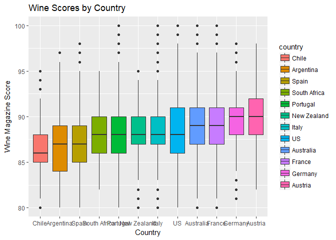
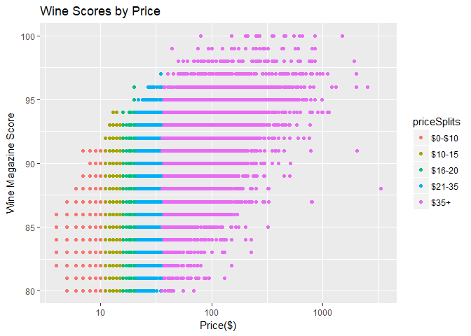
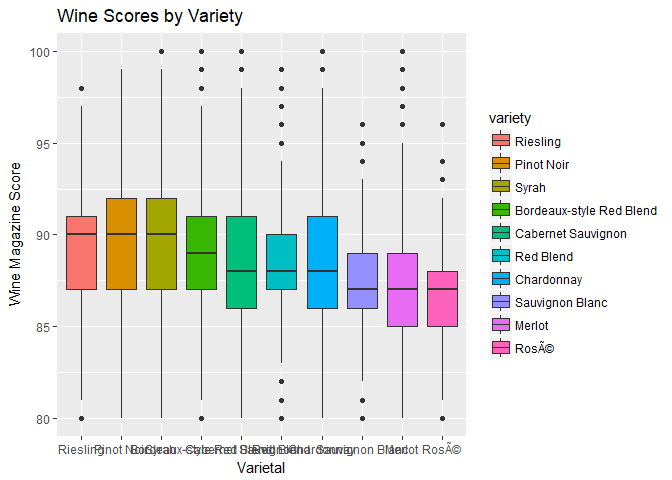
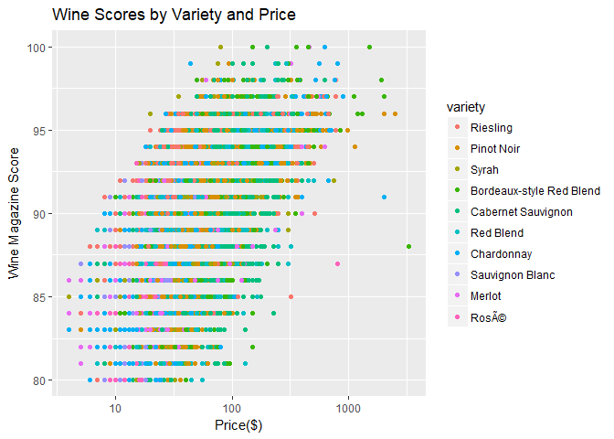

## Planting the Seeds

My first "real" job after college was working for a winery. Some of you may have heard of this one; E&J Gallo Winery. I was just an intern, and didn't really have much of an appreciation for wine and the industry. About all I knew was that I liked the taste, and it was a classy thing to order when I took my girlfriend (now wife) out to dinner. And if you asked me to tell you the difference between a cabernet sauvignon and a pinot grigio, about all I could say that one was red. 

Since that time I have learned that the wine industry is one with many layers and traditions. Some chateaus have existed for centuries, with their books recording sales from medieval times. 

One of the greatest things I learned from my internship was how to taste wine. I am no sommelier, but at least after that class I was able to identify what I liked or disliked about the various wines I would try. 

Spurred by a recent watching of the plethora of wine documentaries that can be found on Netflix nowadays, I started thinking about wine again. This time though the eyes of a data scientist. I started to wonder about the scores, what makes a great vintage, and much else. 

Thankfully I have not been the only one. Rather than developing my own web-scraper to pull data from the various websites that contain wine scores, I found a csv generated by [Zack Thoutt]("https://www.kaggle.com/zynicide/wine-reviews/data") in late 2017 that would be the basis of my analysis. 

It contains 129971 observations, of 13 variables. Zack thoughtfully scraped out information such as province to the cost of the bottle and the score it received. 

## Scoring

### Countries of Excellence
Wine scoring is an interesting exercise in trying to distill many different descriptors of wine into a number to help someone that may not be so knowledgeable about wine know if they are getting a "good one". My first question is whether there is any bias in scoring. Will wines that are produced from the traditional wine producing regions be more likely to receive a higher score?

country         nReviews   Min   Q_1       Mean   Median   Q_3   Max         SD
-------------  ---------  ----  ----  ---------  -------  ----  ----  ---------
Chile               4472    80    85   86.49352       86    88    95   2.692959
Argentina           3800    80    84   86.71026       87    89    97   3.179627
Spain               6645    80    85   87.28834       87    89    98   3.066284
South Africa        1401    82    86   88.05639       88    90    95   2.435826
Portugal            5691    80    86   88.25022       88    90   100   2.996122
New Zealand         1419    80    87   88.30303       88    90    95   2.435008
Italy              19540    80    87   88.56223       88    90   100   2.649756
US                 54504    80    86   88.56372       88    91   100   3.114841
Australia           2329    80    87   88.58051       89    91   100   2.989900
France             22093    80    87   88.84511       89    91   100   3.044423
Germany             2165    81    88   89.85173       90    91    98   2.469351
Austria             3345    82    88   90.10135       90    92    98   2.499799

<!-- -->

Surprisingly, France did not have the highest average, Austria did. Now, this is likely due to my ignorance of historical wine industries, but I had always thought of France before thinking of Germany and Austria as premier wine producing regions. This may be from the Burgundy region of France, but Further digging is needed

### Bottles on a budget

My next curiosity was whether quality wine can be purchased without breaking the bank. In the documentary SOMM:Out of the bottle, one of the sommeliers said you can find great bottles at $20/bottle. Lets put this to the test. Per [statista.com]("https://www.statista.com/statistics/259433/average-price-of-leading-types-of-wine-in-the-us/"), the average cost of a bottle purchased in the United States was USD8.98. Lets make the cuts at 0-10,11-15,16-20,21-35,35+. These cuts are rather arbitrary, but represent where I would personally draw the lines between cooking wine, every day wine, nice wine, wine I am trying to impress with, and wine I will probably never buy!

priceSplits    nReviews   Min   Q_1       Mean   Median   Q_3   Max
------------  ---------  ----  ----  ---------  -------  ----  ----
$0-$10             6280    80    84   85.02404       85    86    91
$10-15            18822    80    85   86.20434       86    88    94
$16-20            21239    80    86   87.36282       87    89    96
$21-35            34891    80    87   88.42618       88    90    97
$35+              39743    80    89   90.57119       91    93   100

<!-- -->

This data and plot seems to indicate what you would expect; the more you spend, the more likely the bottle is to be highly rated. However, you do not have to spend all the money you have in your alcohol budget for the month to impress your date. The highest rating for the \$15-20s bottles was a whopping 96 points, only 1 point less than the highest ratings \$21-35 range. This bottle happens to be from my home state of Washington, and is the 2007 Rulo Syrah (Columbia Valley). I will have to see if I can find any of its cousins around!

### Points on the Vine

My final curiosity was whether certain varietals were predisposed to a higher score. The wine data I have has over 700 varietals, so I will keep only those with over 3000 entries in the data. This should limit us to the main varietals. 

variety                     nReviews   Min   Q_1       Mean   Median   Q_3   Max         SD
-------------------------  ---------  ----  ----  ---------  -------  ----  ----  ---------
Riesling                        5189    80    87   89.45018       90    91    98   2.862513
Pinot Noir                     13272    80    87   89.41147       90    92    99   3.123967
Syrah                           4142    80    87   89.28658       90    92   100   3.037114
Bordeaux-style Red Blend        6915    80    87   89.10644       89    91   100   3.136137
Cabernet Sauvignon              9472    80    86   88.60758       88    91   100   3.316328
Red Blend                       8946    80    87   88.38028       88    90    99   2.776897
Chardonnay                     11753    80    86   88.34008       88    91   100   3.231557
Sauvignon Blanc                 4967    80    86   87.42964       87    89    96   2.685680
Merlot                          3102    80    85   87.20858       87    89   100   2.967417
Rosé                           3564    80    85   86.84624       87    88    96   2.526633

<!-- -->

Unsurprisingly, most of the top tastes wine types were reds. However, the highest rated overall was the Riesling. While I really enjoy Rieslings, I know many that find them sweet. That could be the price range that I am typically in though! Lets see how ratings and price relate for these top varietals.

<!-- -->
